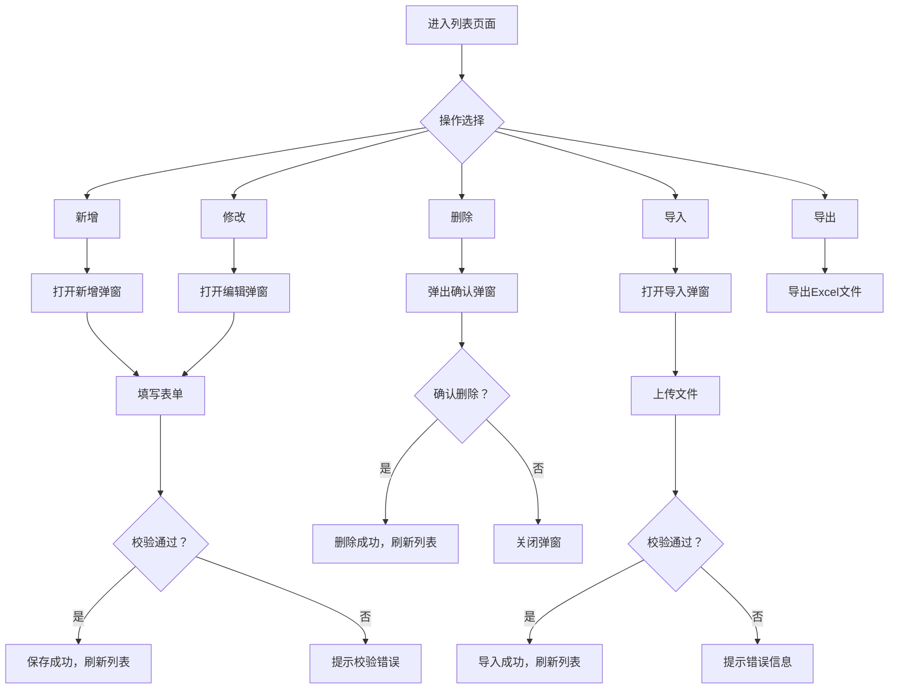
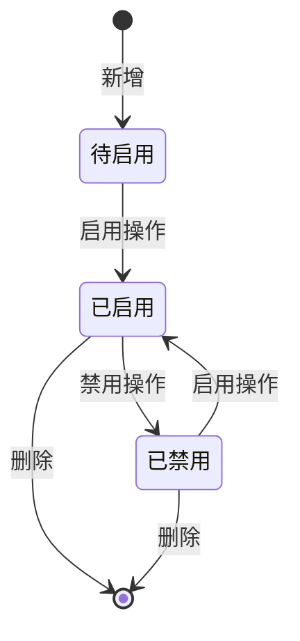
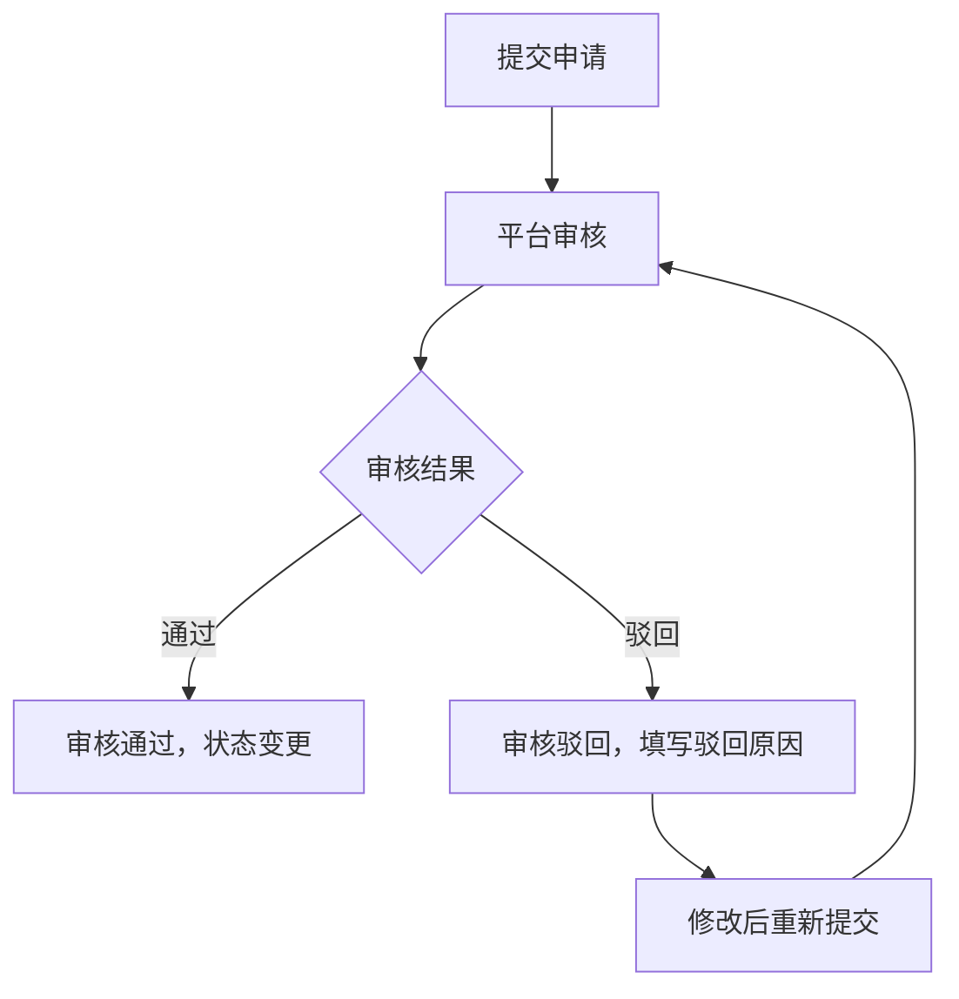

# 【替换】产品 · 【替换】功能设计

***

## 文档信息

| 项目   | 内容                   |
| ---- | -------------------- |
| 文档编号 | 【替换】PRD-XXX-2026-001 |
| 文档版本 | v0.1                 |
| 产品名称 | 【替换】产品名称             |
| 所属系统 | 【替换】系统名称             |
| 编制日期 | 【替换】YYYY-MM-DD       |
| 编制人员 | 【替换】姓名               |

### 修订记录

| 版本   | 修订日期           | 修订说明 | 修订人    |
| ---- | -------------- | ---- | ------ |
| v0.1 | 【替换】YYYY-MM-DD | 初稿创建 | 【替换】姓名 |

***

> **文档使用说明**
>
> - `【替换】` 标记的内容：使用时替换为实际业务内容
> - `【删除】` 标记的内容：仅为填写说明，完成后删除
> - 本模板供 AI 开发智能体读取，请保持结构完整

> **文档撰写规范（重要）**
>
> 1. **严格遵循模板格式**：各章节表格字段必须与模板保持一致
> 2. **聚焦业务规则**：描述业务逻辑、数据约束、权限控制等，不写技术实现细节（如CSS类名、列宽像素、具体代码逻辑）
> 3. **减少不必要的示例**：不写JSON/XML格式的报文示例，仅描述报文格式以实际接口返回为准
> 4. **页面布局与交互分离**：§四仅描述页面结构（长什么样），§五描述业务规则（怎么操作）；字段说明表中「说明」列仅标注极简展示属性（只读/必填\*/系统自动生成），业务约束写在§五

***

## 一、功能角色矩阵说明

### 1.1 功能描述

- **功能名称：** 【替换】功能名称
- **所属模块：** 【替换】模块名称
- **功能描述：** 【替换】简要描述该功能的定位和核心用途，一两句话即可。

### 1.2 角色权限总览

【删除】列举访问此功能的角色，以及各角色的功能权限和数据权限范围。

| 角色      | 功能权限                        | 数据权限   |
| ------- | --------------------------- | ------ |
| 【替换】角色1 | 查看列表、查看详情、新增、修改、查询、删除、导入、导出 | 全量数据   |
| 【替换】角色2 | 查看列表、查看详情、查询                | 仅本机构数据 |
| 【替换】角色3 | 无权限                         | 无权限    |

### 1.3 功能角色矩阵

【删除】每个功能操作是否有权限用"是/否"标注，可按实际功能增减行。

| 功能点  | 【替换】角色1 | 【替换】角色2 | 【替换】角色3 |
| ---- | :-----: | :-----: | :-----: |
| 查看列表 |    是    |    是    |    否    |
| 查看详情 |    是    |    是    |    否    |
| 新增   |    是    |    否    |    否    |
| 修改   |    是    |    否    |    否    |
| 删除   |    是    |    否    |    否    |
| 查询   |    是    |    是    |    否    |
| 导入   |    是    |    否    |    否    |
| 导出   |    是    |    否    |    否    |

***

## 二、模块路径

【删除】描述用户从系统首页进入本功能页面的完整菜单路径。

系统首页 → 【替换】一级菜单 → 【替换】二级菜单 → 【替换】本功能页面

***

## 三、状态流转与流程图

> **章节说明**：用 Mermaid 图描述本功能的核心业务流程和数据状态变迁，帮助读者快速建立全局认知。简单功能可酌情删减子章节。

### 3.1 业务流程图

【删除】用 Mermaid flowchart 语法描述核心操作流程。以下为示例，使用时替换为实际业务流程。



### 3.2 状态流转图

【删除】用 Mermaid stateDiagram 语法描述核心数据的状态变迁。以下为示例，使用时替换为实际业务状态。状态枚举值应与第九章数据字典保持一致。



### 3.3 【可选】审批/审核流程图

【删除】仅涉及审批/审核流程的功能填写本节，无审批流程时删除本节。



***

## 四、页面布局

> **章节说明**：本章节仅描述页面结构——每个页面长什么样、有哪些组件、组件如何排列。业务规则、交互逻辑、约束条件统一写在§五「页面交互说明」中。

### 4.1 页面清单

【删除】列出本功能包含的所有页面/弹窗，便于快速了解功能全貌。§五的子章节将与本清单一一对应。

|  序号 | 页面名称    | 页面类型   | 描述                           |
| :-: | ------- | ------ | ---------------------------- |
|  1  | 列表页面    | 主页面    | 展示数据列表，支持查询、筛选、操作            |
|  2  | 新增/编辑弹窗 | 弹窗     | 新增或编辑单条数据                    |
|  3  | 查看详情弹窗  | 弹窗     | 查看单条数据详情（只读）                 |
|  4  | 批量导入弹窗  | 弹窗（可选） | 上传 Excel 文件完成批量录入，无导入功能时删除本节 |
|  5  | 删除确认弹窗  | 弹窗     | 删除操作二次确认                     |

***

### 4.2 列表页面布局

【删除】用 ASCII Art 绘制页面布局图，直观展示各区域组件位置。绘制规范：

- 用 `┌─┐` 表示输入框/下拉框
- 用 `[按钮]` 表示按钮
- 区域之间用 `───` 分隔

```
┌─────────────────────────────────────────────────────────────────┐
│  查询条件区                                                       │
│  ┌─────────────┐ ┌─────────────┐ ┌──────┐ ┌──────┐             │
│  │ 【字段1】   │ │ 【字段2】   │ │ 查询 │ │ 重置 │             │
│  │ [输入框    ]│ │ [下拉框    ]│ │ 按钮 │ │ 按钮 │             │
│  └─────────────┘ └─────────────┘ └──────┘ └──────┘             │
├─────────────────────────────────────────────────────────────────┤
│  工具栏区    [+新增]  [导入]  [批量删除]         [导出]          │
├─────────────────────────────────────────────────────────────────┤
│  列表数据区                                                       │
│  ┌────┬─────┬──────────┬────────────┬──────────┬────────┐      │
│  │ □  │ 序号 │ 字段1    │ 字段2      │ 状态     │ 操作   │      │
│  ├────┼─────┼──────────┼────────────┼──────────┼────────┤      │
│  │ □  │  1  │ xxx      │ xxx        │ 已启用   │ [详情] [修改] [删除]│      │
│  │ □  │  2  │ xxx      │ xxx        │ 已禁用   │ [详情] [修改] [删除]│      │
│  └────┴─────┴──────────┴────────────┴──────────┴────────┘      │
├─────────────────────────────────────────────────────────────────┤
│  分页区    [< 1 2 3 ... 10 >]  [每页 10 ▼]  共 95 条            │
└─────────────────────────────────────────────────────────────────┘
```

### 4.2.1 查询条件区

| 组件名称    | 组件类型 | 位置 | 提示语            | 说明        |
| ------- | ---- | -- | -------------- | --------- |
| 【替换】字段1 | 输入框  | 居左 | 提示"请输入【替换】字段1" | 【替换】模糊/精确 |
| 【替换】字段2 | 下拉框  | 居左 | 提示"请选择【替换】字段2" | 必填\*      |
| 查询      | 按钮   | 居右 | —              | 主按钮       |
| 重置      | 按钮   | 居右 | —              | 次按钮       |

### 4.2.2 工具栏区

| 组件名称 | 组件类型 | 位置 | 提示语 | 说明          |
| ---- | ---- | -- | --- | ----------- |
| 新增   | 按钮   | 居左 | —   | 【替换】权限控制时显示 |
| 导入   | 按钮   | 居左 | —   | 可选          |
| 批量删除 | 按钮   | 居左 | —   | 灰化，选中数据后启用  |
| 导出   | 按钮   | 居右 | —   | —           |
| 下载模板 | 按钮   | 居右 | —   | 可选          |

### 4.2.3 列表展示区

| 字段      | 组件类型 | 位置 | 说明                |
| ------- | ---- | -- | ----------------- |
| 复选框     | 复选框  | 首列 | 批量操作时勾选           |
| 序号      | 文本   | 居中 | —                 |
| 【替换】字段1 | 文本   | 居左 | —                 |
| 【替换】字段2 | 文本   | 居左 | —                 |
| 状态      | 标签   | 居中 | 枚举-badge样式        |
| 操作      | 按钮组  | 居中 | \[详情] \[修改] \[删除] |

### 4.2.4 分页控件区

| 控件    | 组件类型 | 位置 | 说明      |
| ----- | ---- | -- | ------- |
| 总条数   | 文本   | 居左 | 共0条记录   |
| 页码按钮  | 按钮组  | 居中 | 1高亮     |
| 向前翻页  | 按钮   | 居中 | <       |
| 向后翻页  | 按钮   | 居中 | >       |
| 每页条目数 | 下拉框  | 居右 | 默认10条/页 |
| 跳转至页码 | 输入框  | 居右 | 默认1     |

***

### 4.3 新增/编辑弹窗布局

本弹窗为标准表单式弹窗，由三部分组成：

- **标题栏**：顶部显示"新增/编辑【替换】"，右侧为关闭按钮
- **内容区**：中部为纵向排列的表单字段，每个字段独占一行（标签+输入组件）
- **按钮区**：底部右侧排列"取消"和"确定"两个操作按钮

```
┌─────────────────────────────────────────────────┐
│  新增【替换】                              [X]  │
├─────────────────────────────────────────────────┤
│  ┌─────────────────────────────────────────┐    │
│  │ 【字段1】                                  │    │
│  │ [输入框                                ]  │    │
│  └─────────────────────────────────────────┘    │
│  ┌─────────────────────────────────────────┐    │
│  │ 【字段2】                                  │    │
│  │ [下拉框                                ▼]  │    │
│  └─────────────────────────────────────────┘    │
│  ┌─────────────────────────────────────────┐    │
│  │ 【字段3】                                  │    │
│  │ [系统自动生成    ]                        │    │
│  └─────────────────────────────────────────┘    │
│                                                 │
│                              [取消]  [确定]      │
└─────────────────────────────────────────────────┘
```

### 4.3.1 表单字段说明

| 字段      | 组件类型 | 位置   | 提示语            | 说明        |
| ------- | ---- | ---- | -------------- | --------- |
| 【替换】字段1 | 输入框  | 独占一行 | 提示"请输入【替换】字段1" | 必填\*      |
| 【替换】字段2 | 下拉框  | 独占一行 | 提示"请选择【替换】字段2" | 必填\*      |
| 【替换】字段3 | 文本   | 独占一行 | —              | 只读，系统自动生成 |

### 4.3.2 按钮区

| 按钮 | 组件类型 | 位置 | 说明       |
| -- | ---- | -- | -------- |
| 取消 | 按钮   | 居右 | 关闭弹窗     |
| 确定 | 按钮   | 居右 | 灰化→合规后可用 |

***

### 4.4 查看详情弹窗布局

本弹窗为标准详情式只读弹窗，由三部分组成：

- **标题栏**：顶部显示"查看【替换】信息"，右侧为关闭按钮
- **内容区**：中部为键值对形式展示字段，左侧为字段标签、右侧为值
- **按钮区**：底部右侧仅保留"关闭"按钮

```
┌─────────────────────────────────────────────────┐
│  查看【替换】信息                          [X]  │
├─────────────────────────────────────────────────┤
│  ┌──────────────┐ ┌────────────────────────┐    │
│  │ 【字段1】    │ │ xxx                    │    │
│  └──────────────┘ └────────────────────────┘    │
│  ┌──────────────┐ ┌────────────────────────┐    │
│  │ 【字段2】    │ │ xxx                    │    │
│  └──────────────┘ └────────────────────────┘    │
│  ┌──────────────┐ ┌────────────────────────┐    │
│  │ 添加时间     │ │ 2026-01-01 12:00:00    │    │
│  └──────────────┘ └────────────────────────┘    │
│                                                 │
│                                    [关闭]       │
└─────────────────────────────────────────────────┘
```

### 4.4.1 展示字段说明

| 字段      | 组件类型 | 位置   | 说明         |
| ------- | ---- | ---- | ---------- |
| 【替换】字段1 | 文本   | 独占一行 | 只读         |
| 【替换】字段2 | 文本   | 独占一行 | 只读         |
| 添加时间    | 文本   | 独占一行 | 只读，格式见数据字典 |

***

### 4.5 批量导入弹窗布局

如涉及导入功能，在此补充。

本弹窗为文件上传式弹窗，由三部分组成：

- **标题栏**：顶部显示"批量导入"，右侧为关闭按钮
- **内容区**：中部为拖拽/点击上传区域，支持 .xlsx 文件
- **按钮区**：底部右侧排列"取消"和"导入"两个操作按钮

```
┌─────────────────────────────────────────────────┐
│  批量导入                                  [X]  │
├─────────────────────────────────────────────────┤
│  ┌─────────────────────────────────────────┐    │
│  │           点击或拖拽上传文件              │    │
│  │              [.xlsx 文件]                │    │
│  └─────────────────────────────────────────┘    │
│                                                 │
│                              [取消]  [导入]      │
└─────────────────────────────────────────────────┘
```

<br />

***

### 4.6 删除确认弹窗布局

本弹窗为标准确认式弹窗，由三部分组成：

- **标题栏**：顶部显示"提示"（或"删除确认"），右侧为关闭按钮
- **内容区**：中部为确认提示文案（如"是否确认删除【替换】？"）
- **按钮区**：底部右侧排列"取消"和"确定"两个操作按钮

```
┌─────────────────────────────────────────────────┐
│  提示                                      [X]  │
├─────────────────────────────────────────────────┤
│                                                 │
│         是否确认删除【替换】？                    │
│                                                 │
│                              [取消]  [确定]      │
└─────────────────────────────────────────────────┘
```

<br />

***

## 五、页面交互说明

> **章节说明**：本章节按§4.1页面清单的子章节一一对应，描述每个页面的字段交互规则、操作交互逻辑和弹窗业务规则。

### 5.1 列表页面交互说明

#### 5.1.1 字段交互规则

【删除】列出列表页面中查询条件区各字段的交互规则。

| 字段        | 类型  | 是否必填 | 约束规则                  | 展示规则 | 举例或枚举       |
| --------- | --- | :--: | --------------------- | ---- | ----------- |
| 【替换】查询字段1 | 输入框 |   否  | 【替换】支持模糊/精确查询；最大xx字符  | 明文   | 【替换】示例值     |
| 【替换】查询字段2 | 下拉框 |   否  | 【替换】精确查询；数据源参见第九章数据字典 | 明文   | 【替换】枚举A/枚举B |

#### 5.1.2 操作交互逻辑

【删除】列出列表页面所有操作的交互逻辑，包含正向输出和异常处理。

| 操作类型 | 触发操作     | 交互可用性       | 正向输出                                        | 异常场景                                           | 异常处理             | 日志级别 |
| ---- | -------- | ----------- | ------------------------------------------- | ---------------------------------------------- | ---------------- | ---- |
| 查询   | 点击"查询"   | 始终可用        | 按条件筛选，结果在列表中展示，分页同步更新                       | 【替换】字段格式错误                                     | 输入框变红，下方红字提示错误信息 | 接口级  |
| 重置   | 点击"重置"   | 始终可用        | 清空所有筛选条件，恢复初始查询状态                           | 无                                              | 无                | 接口级  |
| 新增   | 点击"新增"   | 始终可用        | 打开"新增【替换】"弹窗                                | 无                                              | 无                | 接口级  |
| 查看   | 点击"详情"   | 始终可用        | 打开查看弹窗，所有字段只读                               | 无                                              | 无                | 接口级  |
| 修改   | 点击"修改"   | 【替换】未被引用时可用 | 打开"编辑【替换】"弹窗，反显当前数据，支持编辑                    | 已被引用时按钮灰化不可点击                                  | —                | 接口级  |
| 删除   | 点击"删除"   | 【替换】未被引用时可用 | 弹出确认弹窗"是否确认删除？"；确认后执行删除，自动刷新列表              | 已被引用时按钮灰化不可点击                                  | —                | 接口级  |
| 导入   | 点击"导入"   | 始终可用        | 打开"批量导入"弹窗，支持上传Excel文件完成批量录入；全部数据校验通过后一次性导入 | 存在校验错误时，遇错即停不执行导入，提示"第N行：【字段名】+错误原因"；修正后重新上传校验 | Toast提示第一个错误     | 接口级  |
| 下载模板 | 点击"下载模板" | 始终可用        | 触发本地文件管理弹窗，下载批量导入模板.xlsx                    | 模板关联数据获取失败                                     | 弹出提示，同时停止下载      | 接口级  |
| 导出   | 点击"导出"   | 始终可用        | 勾选数据时导出勾选行；未勾选时导出全量数据，下载Excel文件             | 无数据                                            | Toast提示"暂无数据可导出" | 接口级  |

> **导出文件命名规范**：
>
> - 格式：`{业务前缀}_{YYYYMMDD}_{HHMMSS}.xlsx`
> - 示例：`【替换】用户信息_20260405_103045.xlsx`
> - 时间戳：年月日(8位) + 时分秒(6位)，确保文件名唯一性
> - 导入模板：使用固定名称，如 `【替换】批量导入模板.xlsx`（不带时间戳）

***

### 5.2 新增/编辑弹窗交互说明

#### 5.2.1 字段交互规则

【删除】列出新增/编辑弹窗中所有字段的输入规范，填写类型、必填、约束规则、展示规则和举例。

| 字段            | 类型 | 是否必填 | 约束规则                       | 展示规则                | 举例或枚举       |
| ------------- | -- | :--: | -------------------------- | ------------------- | ----------- |
| 【替换】字段1       | 文本 |   是  | 【替换】约束规则，如：支持1-20个汉字，无特殊符号 | 明文                  | 【替换】示例值     |
| 【替换】字段2（手机号类） | 文本 |   是  | 11位数字                      | 脱敏（138\*\*\*\*1234） | 13800001234 |
| 【替换】字段3（只读）   | 文本 |   —  | 系统自动生成，不可手动输入              | 明文                  | 【替换】示例值     |

#### 5.2.2 操作交互逻辑

【删除】列出新增/编辑弹窗中所有操作的交互逻辑。

| 操作类型 | 触发操作      | 交互可用性       | 正向输出                    | 异常场景 | 异常处理               | 日志级别 |
| ---- | --------- | ----------- | ----------------------- | ---- | ------------------ | ---- |
| 确定保存 | 点击"确定"按钮  | 必填字段全部合规后可用 | 弹窗关闭，列表刷新，Toast提示"保存成功" | 保存失败 | Toast提示"保存失败，请重试！" | 接口级  |
| 取消   | 点击"取消"按钮  | 始终可用        | 关闭弹窗，不保存任何数据            | 无    | 无                  | 不记录  |
| 关闭   | 点击右上角\[X] | 始终可用        | 关闭弹窗，不保存任何数据            | 无    | 无                  | 不记录  |

#### 5.2.3 弹窗说明

【删除】列出新增/编辑弹窗的业务规则。

| 规则项  | 说明                                   |
| ---- | ------------------------------------ |
| 打开方式 | 点击列表页工具栏"新增"按钮，或操作列"修改"按钮            |
| 标题   | 新增时显示"新增【替换】"；编辑时显示"编辑【替换】"          |
| 数据反显 | 编辑时自动回填当前记录数据；新增时所有字段为空              |
| 校验时机 | 字段失焦时触发单字段校验；点击"确定"时触发全量校验           |
| 保存规则 | 全部校验通过后提交保存；校验失败时字段下方显示红色提示文本，字段边框变红 |
| 关闭确认 | 如有未保存的修改，关闭时弹出二次确认"是否放弃编辑？"          |

***

### 5.3 查看详情弹窗交互说明

#### 5.3.1 字段交互规则

【删除】列出查看详情弹窗中所有展示字段的规则。

| 字段      | 组件类型 | 是否必填 | 约束规则       | 展示规则 | 举例或枚举               |
| ------- | ---- | :--: | ---------- | ---- | ------------------- |
| 【替换】字段1 | 文本   |   —  | 只读，不可编辑    | 明文   | 【替换】示例值             |
| 【替换】字段2 | 文本   |   —  | 只读，不可编辑    | 明文   | 【替换】示例值             |
| 添加时间    | 文本   |   —  | 只读，格式见数据字典 | 明文   | 2026-01-01 12:00:00 |

#### 5.3.2 操作交互逻辑

| 操作类型 | 触发操作     | 交互可用性 | 正向输出        | 异常场景 | 异常处理 | 日志级别 |
| ---- | -------- | ----- | ----------- | ---- | ---- | ---- |
| 关闭   | 点击"关闭"按钮 | 始终可用  | 关闭弹窗，返回列表页面 | 无    | 无    | 不记录  |

***

### 5.4 批量导入弹窗交互说明

#### 5.4.1 字段交互规则

【删除】列出导入模板中各字段的规范。

| 字段名称    | 是否必填 | 填写规则     | 填写示例   |
| ------- | :--: | -------- | ------ |
| 【替换】字段1 |   是  | 【替换】约束规则 | 【替换】示例 |
| 【替换】字段2 |   否  | 【替换】约束规则 | 【替换】示例 |

#### 5.4.2 操作交互逻辑

| 操作类型 | 触发操作       | 交互可用性   | 正向输出                          | 异常场景               | 异常处理                         | 日志级别 |
| ---- | ---------- | ------- | ----------------------------- | ------------------ | ---------------------------- | ---- |
| 选择文件 | 点击或拖拽上传    | 始终可用    | 展示文件名及删除按钮                    | 格式非.xlsx           | Toast提示"请上传正确格式的Excel文件"     | 不记录  |
| 确认导入 | 点击"导入"按钮   | 选择文件后可用 | 全部校验通过后一次性导入，展示"导入成功，共导入X条数据" | 文件超10MB            | Toast提示"文件大小不能超过10MB"        | 接口级  |
| 取消   | 点击"取消"按钮   | 始终可用    | 关闭弹窗                          | 数据校验失败（必填/格式/唯一性等） | 遇错即停，Toast提示"第N行：【字段名】+错误原因" | 不记录  |
| 下载模板 | 点击"下载模板"链接 | 始终可用    | 下载批量导入模板.xlsx                 | 模板数据获取失败           | 弹出提示，同时停止下载                  | 不记录  |

#### 5.4.3 弹窗说明

【删除】列出批量导入弹窗的业务规则。

| 规则项  | 说明                                               |
| ---- | ------------------------------------------------ |
| 文件格式 | 仅支持 .xlsx 文件                                     |
| 文件大小 | 不超过 10MB                                         |
| 校验方式 | 逐行前置校验，遇错即停，不检查后续行，不执行导入                         |
| 成功提示 | "导入成功，共导入X条数据"                                   |
| 错误提示 | "第N行：【字段名】+错误原因，请修正后重新上传"                        |
| 模板结构 | 【替换】如：Sheet1为导入数据（必填）；Sheet2为字典参考（只读，不参与导入）；按需增减 |

***

### 5.5 删除确认弹窗交互说明

#### 5.5.1 操作交互逻辑

| 操作类型 | 触发操作     | 交互可用性 | 正向输出             | 异常场景 | 异常处理    | 日志级别 |
| ---- | -------- | ----- | ---------------- | ---- | ------- | ---- |
| 确认删除 | 点击"确定"按钮 | 始终可用  | 执行删除，弹窗关闭，列表自动刷新 | 删除失败 | Toast提示 | 接口级  |
| 取消   | 点击"取消"按钮 | 始终可用  | 关闭弹窗，不做任何操作      | 无    | 无       | 不记录  |

#### 5.5.2 弹窗说明

| 规则项  | 说明              |
| ---- | --------------- |
| 触发条件 | 点击列表行操作列的"删除"按钮 |
| 提示文案 | "是否确认删除【替换】？"   |
| 确认操作 | 执行删除，弹窗关闭，列表刷新  |
| 取消操作 | 关闭弹窗不做任何操作      |

***

### 5.6 其他页面交互说明（如有）

参照上述格式补充。

***

## 六、错误处理规范

### 6.1 表单校验错误

- 显示方式：对应字段下方显示红色提示文本，字段边框变红
- 触发时机：表单提交时触发全量校验；字段失去焦点时触发单字段校验

| 字段      | 为空时错误信息     | 格式错误时信息           |
| ------- | ----------- | ----------------- |
| 【替换】字段1 | 【替换】字段1不能为空 | 【替换】字段1格式不正确，应为xx |
| 【替换】字段2 | 请选择【替换】字段2  | —                 |

### 6.2 文件操作错误

| 场景      | 触发条件                         | 提示文案                    | 处理方式                       |
| ------- | ---------------------------- | ----------------------- | -------------------------- |
| 导入-格式错误 | 上传非 .xlsx 文件                 | 请上传正确格式的 Excel 文件       | Toast 提示，阻断上传              |
| 导入-超大文件 | 文件超过 10MB                    | 文件大小不能超过 10MB           | Toast 提示，阻断上传              |
| 导入-校验失败 | 数据存在校验错误（必填/格式/长度/唯一性/关联数据等） | 第N行：【字段名】+错误原因，请修正后重新上传 | 遇错即停，不执行任何数据导入；用户修正后重新上传校验 |
| 导出-无数据  | 当前查询结果为空                     | 暂无数据可导出                 | Toast 提示                   |
| 网络/服务异常 | 接口请求失败                       | 接口异常，请稍候再试              | Toast 提示                   |

***

## 七、非功能性需求

### 7.1 合规与安全要求

【删除】根据本模块实际情况，填写适用的合规要求。如项目有通用安全规范文件，可引用并补充模块特有要求。

| 适用规范       | 内容摘要              | 本模块特有说明                    |
| ---------- | ----------------- | -------------------------- |
| 【替换】访问控制   | RBAC最小权限、数据权限隔离   | 【替换】如：普通用户仅可查看本人数据         |
| 【替换】操作日志   | 字段级日志、保留期限、不可篡改   | 【替换】覆盖操作：新增/修改/删除/…（按实际填写） |
| 【替换】敏感数据脱敏 | 各字段脱敏规则           | 【替换】如：手机号脱敏；或：本模块无敏感字段     |
| 【替换】文件操作安全 | 导出上限、下载鉴权、导出行为记日志 | 【替换】如：单次导出上限1000条          |

### 7.2 性能需求

【删除】列出本模块的性能指标要求，填写实际约束；通用默认值可直接使用，有特殊要求的模块按实际填写。

| 需求项       | 指标要求          | 说明            |
| --------- | ------------- | ------------- |
| 列表查询响应时间  | ≤ 2s          | 正常网络条件下，含分页查询 |
| 保存/提交响应时间 | ≤ 3s          | 新增/修改/删除等写操作  |
| 导出响应时间    | ≤ 5s（1000条以内） | 超出时建议提示异步处理   |
| 页面首屏加载时间  | ≤ 3s          | —             |
| 并发用户数     | 【替换】          | 按实际业务填写       |

***

## 八、特殊说明

【删除】补充业务逻辑特殊约束、编码规则、联动关系、删除/修改限制等，不适合放在上方章节的内容写在这里。

### 8.1 【替换】编码规则

| 项目   | 规则说明              |
| ---- | ----------------- |
| 编码格式 | 【替换】固定前缀 + 位数序号   |
| 起始序号 | 【替换】从"0001"开始     |
| 完整示例 | 【替换】XX0001、XX0002 |
| 唯一性  | 唯一标识，不可重复         |
| 生成方式 | 系统自动生成，不可手动输入或修改  |

### 8.2 【替换】删除及修改限制

【替换】说明当前记录在什么情况下不允许删除或修改，例如：已被其他模块引用时，按钮灰化置灰，不可操作；查看操作始终可用。

### 8.3 【替换】其他特殊规则

1. 【替换】特殊规则1：说明业务约束或联动逻辑
2. 【替换】特殊规则2：说明唯一性或数据生命周期

***

## 九、数据字典

【删除】集中定义本功能中所有枚举/字典值，供前端枚举映射和开发智能体读取。

### 9.1 字典项定义

**【替换】状态字段（xxxStatus）**

| 枚举值（code） | 显示文本（label） | 说明     |
| :-------: | ----------- | ------ |
|     0     | 【替换】状态A     | 【替换】说明 |
|     1     | 【替换】状态B     | 【替换】说明 |

**【替换】类型字段（xxxType）**

| 枚举值（code） | 显示文本（label） | 说明     |
| :-------: | ----------- | ------ |
|     1     | 【替换】类型A     | 【替换】说明 |
|     2     | 【替换】类型B     | 【替换】说明 |

### 9.2 下拉框数据来源说明

| 字段名     | 数据来源类型 | 来源说明                        |
| ------- | ------ | --------------------------- |
| 【替换】字段1 | 字典项    | 参见 9.1 xxxStatus            |
| 【替换】字段2 | 接口动态加载 | 来源：【替换】管理模块接口 /api/xxx/list |

***

## 十、外部系统接口说明

> **章节说明**：描述本功能与外部系统之间的业务接口关系。仅写业务功能概要，不写API技术细节（如URL路径、请求方法、参数结构等技术实现由技术设计文档承载）。

### 10.1 接口清单

【删除】列出本功能涉及的所有外部系统业务接口。无外部系统交互时删除本章节。

| 接口名称    | 功能描述           | 交互方向     | 依赖系统     | 数据流向                    |
| ------- | -------------- | -------- | -------- | ----------------------- |
| 【替换】接口1 | 【替换】描述该接口的业务功能 | 调用 / 被调用 | 【替换】系统名称 | 【替换】本系统→外部系统 / 外部系统→本系统 |
| 【替换】接口2 | 【替换】描述该接口的业务功能 | 调用 / 被调用 | 【替换】系统名称 | 【替换】本系统→外部系统 / 外部系统→本系统 |

### 10.2 接口详细说明

【删除】按需展开每个接口的业务规则和约束。

**【替换】接口1**

| 规则项  | 说明                    |
| ---- | --------------------- |
| 触发时机 | 【替换】何时调用该接口           |
| 请求条件 | 【替换】前置条件，如：数据状态为"已审核" |
| 成功处理 | 【替换】成功后业务状态变更         |
| 失败处理 | 【替换】失败后业务状态保持/回滚      |
| 重试机制 | 【替换】是否自动重试及重试次数       |

***

*文档结束*
